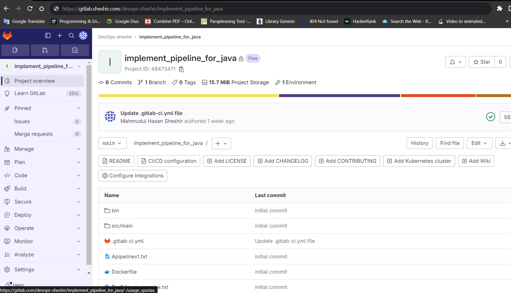
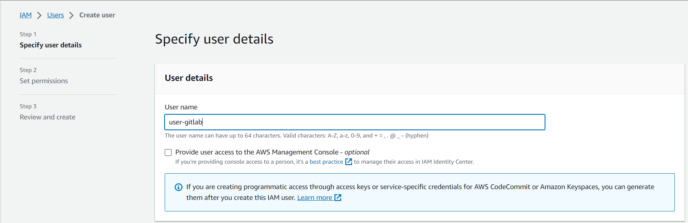
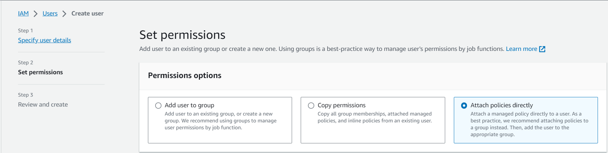
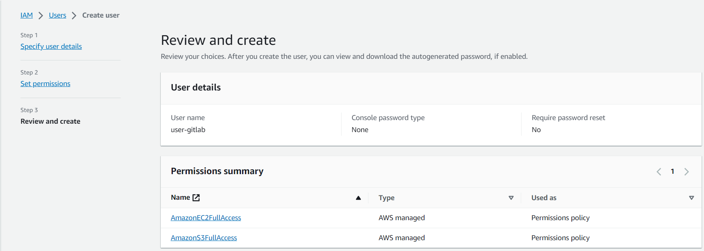
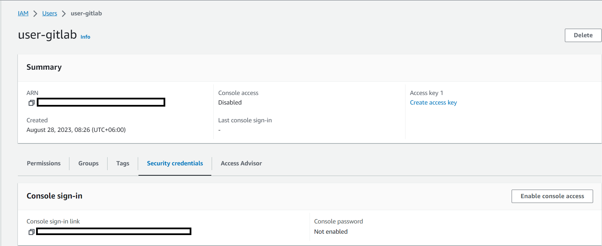
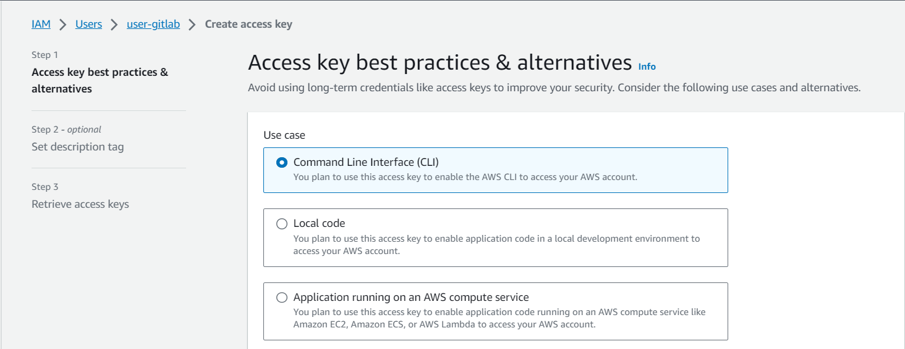
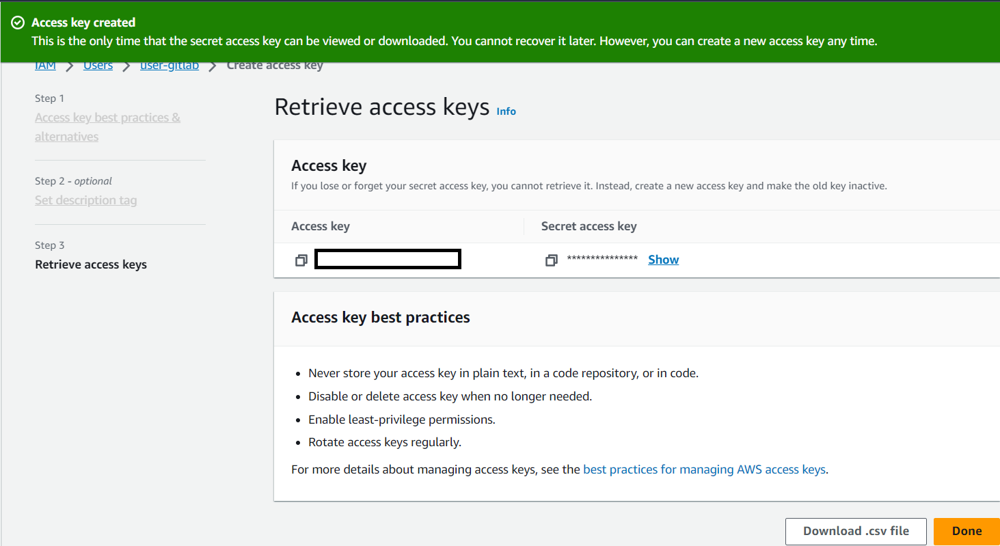
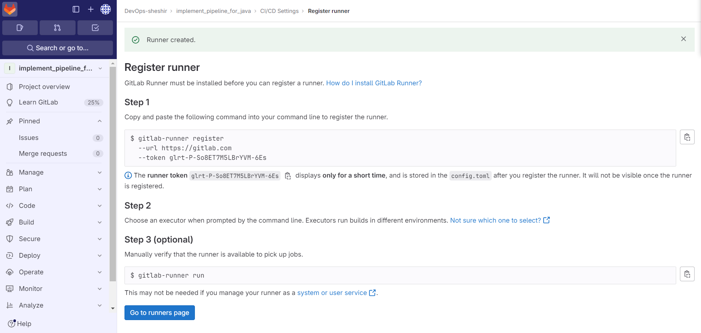

# GitLab Runner Autoscaling Using AWS EC2 Instances

## Overview:
This documentation provides a comprehensive guide on implementing GitLab Runner autoscaling using Amazon Web Services (AWS) Elastic Compute Cloud (EC2) instances. GitLab Runner autoscaling optimizes resource utilization and reduces costs by dynamically provisioning and terminating EC2 instances based on the workload. This guide covers the setup, configuration, and best practices for achieving efficient and flexible GitLab CI/CD pipelines through autoscaling with AWS EC2 instances.


## Introduction

GitLab Runner, a key component of GitLab's CI/CD toolset, executes tasks defined in `.gitlab-ci.yml` files, streamlining development workflows. However, as project demands vary, static resources can lead to inefficiencies.GitLab Runner autoscaling using Amazon Web Services (AWS) Elastic Compute Cloud (EC2) instances solves this challenge. By dynamically provisioning and terminating EC2 instances based on workload, GitLab Runner can adapt to varying demands efficiently.

### Advantages

- **Optimized Costs:** Autoscaling ensures resources are allocated only when needed, reducing expenses.
- **Flexibility:** Resources automatically adjust to demand, maintaining performance during peaks.
- **Scalability:** The system grows or shrinks in response to changes, maintaining responsiveness.
- **Resource Utilization:** Efficiently utilizes resources to avoid waste.
- **Swift Deployment:** Quick provisioning of instances accelerates deployment times.

## Prerequisites

To implement GitLab Runner autoscaling using AWS EC2, you'll need :

- A GitLab account for CI/CD management.
- An AWS account to leverage EC2 resources.
- An AWS IAM user with necessary permissions.

## Private GitLab server setup

For the project, a private GitLab server has been established. The GitLab server has been provisioned in an Ubuntu machine and for installation, GitLab official installation [documentation](https://docs.gitlab.com/omnibus/installation/) is followed.



## AWS IAM user configuration

IAM user access is needed to the GitLab server to spin up new runner instances in AWS. In order to do that an IAM user is created in AWS IAM service with the name "user-gitlab". 

After creating the IAM user now we have to give the required access permissions to the user in order to create EC2 instances in AWS console. As AWS has already created some policies for the ease of work, we'll choose the necessary policies from the "Attach necessary policies"

To perform the autoscaling and caching operation full access to AWS EC2 and S3 bucket is essential.


After providing the required access to the IAM user we need to specify the user credentials for secure operations. In order to create user access credentials we have to follow the given instructions:
IAM > User > USer_name > Security_Credentials > Create_Access_Key

As we will be only using this user account to create and terminate instances we don't have to give it console access. Accessing the AWS command line interface would be perfect for the user.

Now, access credentials are generated and provided in a `.csv` file, we have to store it securely for future.


## Setting Up GitLab Runner Autoscaling

Configuring GitLab Runner to enable autoscaling involves several steps:

### Step 1: Install and Configure GitLab Runner

GitLab runner is installed using the official documentation of GitLab. [Click here](https://docs.gitlab.com/runner/install/linux-repository.html) for the installation guide. To meet the requirement of autoscaling runner we have to install another package named "GitLab Multi-runner". After installing the runner the below command is executed to set the path of the package to source.

```
cat <<EOF | sudo tee /etc/apt/preferences.d/pin-gitlab-runner.pref
Explanation: Prefer GitLab provided packages over the Debian native ones
Package: gitlab-runner
Pin: origin packages.gitlab.com
Pin-Priority: 1001
EOF
```
After souring the path the machine is updated to install the latest package of gitlab multi-runner.
```
sudo apt-get update
sudo apt-get install gitlab-runner
```
Now download the Docker machine in the runner machine which will allow the runner to install docker and the necessary tools to create a docker environment in target machines. [Click here](https://docs.docker.com/machine/install-machine/) to install docker-machine. Lastly setup [docker](https://docs.docker.com/engine/install/ubuntu/) to the runner machine.

### Step 2: Choose AWS EC2 as the Executor

To register the GitLab runner to the project we used the generated registration token by the GitLab server.
`Gitlab project > Settings(Left side navigation) > CICD > RUNNERS > New Project Runner.`<br> 

Clicking on the `New Project Runner` will prompt a new window with instructions given how to register a runner to the project along with the registration token.
<br>

Following the given instructions  we will be able to register a runner. However, while specifying the executor we have selected `docker+machine`. Because it will work as a docker-machine that will handle all the containerization operations in the target servers. 

### Step 3: Define the Autoscaling Strategy
In this section, we will be discussing how the runner is configured to execute the auto scaling operation. 
The autoscaling strategy is configured based on our project's requirements. We set thresholds for scaling up or down and specified the instance types to use.<br>

By following these steps, we have configured GitLab Runner autoscaling with AWS EC2 instances up and running, ready to optimize our CI/CD pipelines dynamically.
At first, we opened the GitLab runner configuration file which is located at `/etc/gitlab-runner/config.toml`

**Global Configuration**
```
concurrent = 1
check_interval = 1
```
It is said to be the global section of the runner configuration. <br>
`concurrent`: It defines the limit of the jobs that one runner can run concurrently or parallelly. In our case, we have set the limit to 1 so that one runner instance can run only 1 job concurrently.<br>
`check_interval`: It sets the time interval of the runner to check for a new job in the GitLab server. We have set the interval of checking for a job to 1 sec.

**Runner Configuration**
```
[[runners]]
  name = "docker-machine"
  limit = 10
  url = "https://gitlab.com/"
  id = 27196664
  token = "*******"
  token_obtained_at = 2023-08-24T04:59:29Z
  token_expires_at = 0001-01-01T00:00:00Z
  executor = "docker+machine"
```
It is the most crucial part of the configuration where the executor is defined <br>
`name = docker-machine: We set the name of the runner to 'docker-machine'<br> <br>
`limit = 10`: We set the max limit of the runner machines to spin up based on the maximum workload.<br> <br>
`url = "https://gitlab.com/"`: It is the base URL of the GitLab server that we are using for our project.<br> <br>
`id = 271545`: It is the id of the runner which is auto-generated.<br> <br>
`token`: It is the GitLab runner registration token that is generated in the server console and discussed in the previous step(2).<br> <br>
`executor = docker+machine`: It is the executor of the runner which is also discussed in the previous section.<br> <br>

**`runners.docker` configuration**
```
 [runners.cache]
    Type = "s3"
    Shared = true
    MaxUploadedArchiveSize = 0
    [runners.cache.s3]
      ServerAddress = "s3.amazonaws.com"
      AccessKey = "***"
      SecretKey = "***"
      BucketName = "sheshir001"
      BucketLocation = "us-east-1"
```
This configuration is essential for the GitLab Runner to know where and how to store and retrieve cache data. Using S3 for caching can be beneficial for distributed systems where runners may not have access to a local filesystem or for persisting cache data across runners <br> <br>
`[runners.cache]`: This line signifies the start of the configuration for the runner's cache settings.<br> <br>
`Type = "s3"`: This line sets the type of cache to S3. This means that the runner will use an S3-compatible storage for caching.<br> <br>
`Shared = true`: This line enables the cache to be shared among all runners. This is useful when different runners need to access the same cached data<br> <br>
`MaxUploadedArchiveSize = 0`: This line sets the maximum size of uploaded archives to 0, which means there is no limit<br> <br>
`[runners.cache.s3]`: This line signifies the start of the configuration for the S3 settings<br> <br>
`ServerAddress = "s3.amazonaws.com"`: This line sets the server address of the S3 bucket to "s3.amazonaws.com"<br> <br>
`AccessKey = "***"`: This line sets the access key for the S3 bucket<br> <br>
`SecretKey = "***"`: This line sets the secret key for the S3 bucket <br> <br>
`BucketName = "sheshir001"`: This line sets the name of the S3 bucket to "sheshir001"<br> <br>
`BucketLocation = "us-east-1"`: This line sets the location of the S3 bucket to "us-east-1"<br> <br>

**[runners.machine] configuration**
```
 [runners.machine]
    IdleCount = 2
    IdleScaleFactor = 1.2
    IdleCountMin = 0
    MaxBuilds = 10
    MachineDriver = "amazonec2"
    MachineName = "runner-%s"
    MachineOptions = [
"amazonec2-access-key=***",
"amazonec2-secret-key=***",
"amazonec2-region=us-east-1",
"amazonec2-vpc-id=vpc-03780aad03ecead68",
"amazonec2-subnet-id=subnet-0d2a8dd3dc997ebb0",
"amazonec2-zone=a",
"amazonec2-use-private-address=false",
"amazonec2-tags=runner-manager-name,gitlab-aws-autoscaler,gitlab,true,gitlab-runner-autoscale,true",
"amazonec2-security-group=sheshir-security",
"amazonec2-instance-type=t2.small"]
```
This configuration is important for defining how the GitLab Runner manages machines for running jobs. The settings can be adjusted based on the specific requirements of the tasks that the runner will be performing.<br> <br>
`[runners.machine]`: This line signifies the start of the configuration for the runner's machine settings.<br> <br>
`IdleCount = 2`: This line sets the number of idle machines that the runner should maintain. This can help to reduce the time it takes to start new jobs, as there are already machines available<br> <br>
`IdleScaleFactor = 1.2`: This line sets the scale factor for idle machines. The runner will try to maintain the number of idle machines as a factor of the number of machines currently in use <br> <br>
`IdleCountMin = 2`: This line sets the minimum number of idle machines that should be maintained, regardless of what the IdleScaleFactor evaluates. <br> <br>
`MaxBuilds = 15`: This line sets the maximum number of builds that each machine can handle. After a machine has handled this number of builds, it will be removed<br> <br>
`MachineDriver = "amazonec2"`: This line sets the machine driver to Amazon EC2. This means that the runner will create and manage Amazon EC2 instances.<br> <br>
`MachineName = "runner-%s"`: This line sets the name of the machine. The '%s' is a placeholder that will be replaced with a unique identifier for each machine.<br> <br>
`MachineOptions = [...]`: This line sets a list of options for the machine. These options include the access key and secret key for the Amazon EC2 instances, the region, the VPC ID, the subnet ID, the availability zone, whether to use a private address, the tags for the instances, the security group, and the instance type.<br> <br>
`"amazonec2-access-key=***"`: This line sets the access key for the Amazon EC2 instances. This key is used to authenticate with the Amazon EC2 service <br> <br>
`"amazonec2-secret-key=***"`: This line sets the secret key for the Amazon EC2 instances. This key is used along with the access key to authenticate with the Amazon EC2 service <br> <br>
`"amazonec2-region=us-east-1"`: This line sets the region where the Amazon EC2 instances will be created<br> <br>
`"amazonec2-vpc-id=vpc-03780aad03ecead68"`: This line sets the VPC (Virtual Private Cloud) ID for the Amazon EC2 instances. The instances will be created within this VPC.<br> <br>
`"amazonec2-subnet-id=subnet-0d2a8dd3dc997ebb0"`: This line sets the subnet ID for the Amazon EC2 instances. The instances will be created within this subnet\. Be aware that if the subnet should be public if the GitLab server is publicly hosted or the target machines are not in the same VPC.<br> <br>
`"amazonec2-zone=a"`: This line sets the availability zone for the Amazon EC2 instances. The instances will be created within this zone<br> <br>
`"amazonec2-use-private-address=false"`: This line sets whether to use a private address for the Amazon EC2 instances. If set to true, the instances won't have a public IP address.<br> <br>
`"amazonec2-tags=runner-manager-name,gitlab-aws-autoscaler,gitlab,true,gitlab-runner-autoscale,true"`: This line sets the tags for the Amazon EC2 instances. These tags can be used for identification and grouping of instances<br> <br>
`"amazonec2-security-group=sheshir-security"`: This line sets the security group for the Amazon EC2 instances. This defines the rules for inbound and outbound traffic to the instances.<br> <br>
We have to set the security group name in this field, not the ID.<br> <br>
`"amazonec2-instance-type=t2.small"`: This line sets the instance type for the Amazon EC2 instances. This defines the hardware of the host computer for the instances

## Full configured Runner 

```
concurrent = 1
check_interval = 0

[session_server]
  session_timeout = 1800

[[runners]]
  name = "docker-machine"
  limit = 10
  url = "https://gitlab.com/"
  id = 27196664
  token = "glrt--ztwCtySr2wKxLdoY9kz"
  token_obtained_at = 2023-08-24T04:59:29Z
  token_expires_at = 0001-01-01T00:00:00Z
  executor = "docker+machine"
  [runners.docker]
    tls_verify = false
    image = "alpine"
    privileged = true
    disable_entrypoint_overwrite = false
    oom_kill_disable = false
    disable_cache = true
    volumes = ["/cache"]
    shm_size = 0

  [runners.cache]
    Type = "s3"
    Shared = true
    MaxUploadedArchiveSize = 0
    [runners.cache.s3]
      ServerAddress = "s3.amazonaws.com"
      AccessKey = "***"
      SecretKey = "***"
      BucketName = "sheshir001"
      BucketLocation = "us-east-1"
  [runners.machine]
    IdleCount = 2
    IdleScaleFactor = 1.2
    IdleCountMin = 0
    MaxBuilds = 10
    MachineDriver = "amazonec2"
    MachineName = "runner-%s"
    MachineOptions = ["amazonec2-access-key=***", "amazonec2-secret-key=***F", "amazonec2-region=us-east-1", "amazonec2-vpc-id=vpc-03780aad03ecead68", "amazonec2-subnet-id=subnet-0d2a8dd3dc997ebb0", "amazonec2-zone=a", "amazonec2-use-private-address=false", "amazonec2-tags=runner-manager-name,gitlab-aws-autoscaler,gitlab,true,gitlab-runner-autoscale,true", "amazonec2-security-group=sheshir-security", "amazonec2-instance-type=t2.small"]
```

## Notes
Notes:

Under MachineOptions you can add anything that the AWS Docker Machine driver
supports. You are highly
encouraged to read Docker's docs as your infrastructure setup may warrant
different options to be applied.
The child instances will use by default Ubuntu 16.04 unless you choose a
different AMI ID by setting amazonec2-ami. Set only supported
base operating systems for Docker Machine.
If you specify amazonec2-private-address-only=true as one of the machine
options, your EC2 instance won't get assigned a public IP. This is ok if your
VPC is configured correctly with an Internet Gateway (IGW) and routing is fine,
but it’s something to consider if you've got a more complex configuration. Read
more in [Docker docs about VPC connectivity.](https://docs.docker.com/machine/drivers/aws/#vpc-connectivity)
